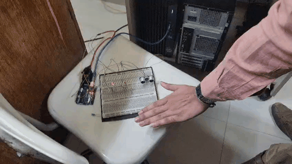
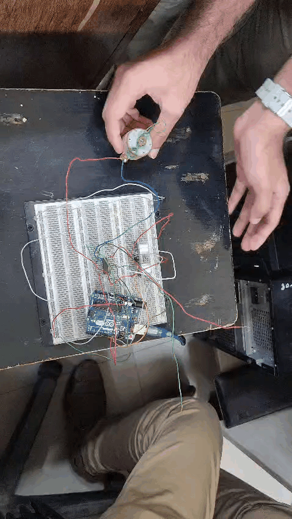
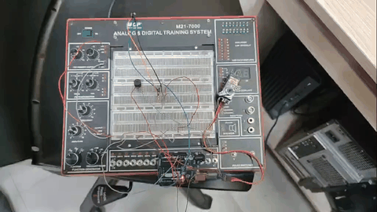

# Microprocessors and Microcontrollers Lab Reports

This repository contains my Microprocessors and Microcontrollers Lab projects developed using Arduino Uno, sensors, motors, servo motors, relays, and wireless control modules.

## Projects

| No. | Project | Main Components |
|---|---|---|
| 01 | Traffic Light Control using Servo Motor and LEDs | Arduino Uno, LEDs, Servo Motor |
| 02 | Distance Measurement Using Ultrasonic Sensor | Arduino Uno, HC-SR04, LEDs, Servo Motor |
| 03 | Touch Sensor Door Lock System | Arduino Uno, Touch Sensor, Servo Motor, Buzzer |
| 04 | Water Level and Pump Control | Arduino Uno, HC-SR04, L293D, DC Pump |
| 05 | Wireless Theft Detection | Arduino Uno, PIR Sensor, Servo Motor, Buzzer |
| 06 | Remote AC Bulb Control | Arduino Uno, IR Receiver, IR Remote, Relay |

## Demonstrations

### Ultrasonic Distance Measurement

### Touch Sensor Door Lock

### Water Level and Pump Control

### Wireless Theft Detection

### Remote AC Bulb Control

## Course Information

- Course: Microprocessors and Microcontrollers Lab
- Course Code: CSE 316
- Department: Computer Science and Engineering
- University: University of Asia Pacific
